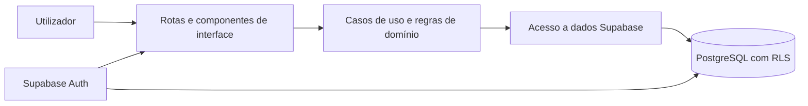

# Arquitectura — Despact

## Objectivo

Esta arquitectura privilegia segurança, clareza e evolução incremental. A aplicação começa como um monólito modular: uma única aplicação Next.js e um único projecto Supabase, com fronteiras por funcionalidade. Não há microserviços, filas ou API pública no MVP.

## Decisão tecnológica

- **Next.js App Router:** estrutura de rotas, renderização e camada de servidor da aplicação.
- **React e TypeScript estrito:** interface e contratos explícitos entre camadas.
- **Tailwind CSS e shadcn/ui:** base visual consistente, acessível e adaptável, sem criar um sistema de componentes próprio antes de ser necessário.
- **Supabase:** Auth, PostgreSQL e autorização ao nível da linha.
- **Vercel:** alojamento da aplicação Next.js.
- **Recharts:** gráficos apenas quando ajudam uma decisão no painel.

O App Router usa componentes de servidor por predefinição. Isto reduz JavaScript enviado ao browser e permite obter dados no servidor. Componentes cliente são usados apenas onde há interacção, estado local ou APIs do browser.

## Fronteiras da aplicação



- **Rotas e interface:** apresentam dados, recebem intenção do utilizador e não contêm cálculos financeiros nem SQL.
- **Casos de uso/domínio:** validam regras como criar uma transacção, criar uma transferência ou calcular indicadores. Funções de cálculo são puras e testáveis.
- **Acesso a dados:** concentra consultas e persistência Supabase. Não decide regras de negócio.
- **Base de dados:** impõe integridade e isolamento de dados, mesmo que exista um erro na interface ou na camada de aplicação.

Não será criada uma camada genérica de `repository`, `service` ou DTO para cada tabela. Os módulos são criados quando representam uma operação ou regra concreta do produto; a finalidade é clareza, não abstração por si só.

## Estrutura planeada

```text
src/
  app/
    (auth)/                 # páginas públicas de autenticação
    (app)/                  # páginas autenticadas e layout principal
    actions/                # acções de servidor transversais, se necessárias
  components/
    ui/                     # componentes shadcn/ui
    shared/                 # componentes reutilizáveis sem lógica de domínio
  features/
    accounts/
    transactions/
    categories/
    goals/
    dashboard/
    insights/
  lib/
    supabase/               # clientes browser e servidor, e gestão de sessão
    validation/             # esquemas de validação reutilizáveis
    money/                  # formatação de moeda sem regra de negócio
  types/                    # tipos transversais e tipos gerados da base de dados
supabase/
  migrations/               # esquema, funções, RLS e alterações versionadas
docs/
```

Cada funcionalidade em `features/` pode conter componentes específicos, validação, casos de uso, consultas e tipos próprios. Um ficheiro só sobe para `components/`, `lib/` ou `types/` quando for realmente partilhado.

## Leitura e escrita de dados

- Páginas e componentes de servidor obtêm dados directamente através dos módulos da funcionalidade, sem chamadas HTTP à própria aplicação.
- Formulários usam Server Actions para mutações internas do produto.
- Cada acção autentica o utilizador, valida a entrada no servidor, executa o caso de uso e invalida os dados apresentados quando necessário.
- Route Handlers ficam reservados para integrações externas ou endpoints que precisem de HTTP. Não serão usados como intermediário entre componentes de servidor e a base de dados.
- O cliente Supabase de browser só é usado quando for necessário no browser; segredos e privilégios administrativos nunca são enviados para o cliente.

## Autenticação e segurança

- A sessão usa a integração SSR actual do Supabase e cookies; haverá clientes Supabase distintos para servidor e browser.
- Todas as rotas do espaço da aplicação exigem sessão autenticada.
- `auth.users` é a identidade canónica. Uma eventual tabela `profiles` só guarda dados de produto que não pertencem ao serviço de autenticação.
- Todas as tabelas com dados do utilizador incluem `user_id`, com integridade referencial para o utilizador autenticado.
- A Row Level Security é activada em todas essas tabelas desde a primeira migração. As políticas permitem operações apenas quando `user_id = auth.uid()`.
- A chave `service_role`, caso venha a ser necessária no futuro, é exclusiva de ambientes de servidor seguros e não participa em operações normais do MVP.

RLS é a última barreira de isolamento; verificações na aplicação melhoram a experiência, mas não a substituem.

## Validação, erros e tipos

- TypeScript funciona em modo estrito.
- A validação de formulários é partilhada entre interface e servidor, mas o servidor é sempre a fonte de validação efectiva.
- Erros de domínio esperados são devolvidos com mensagens compreensíveis; falhas inesperadas são registadas sem expor detalhes sensíveis.
- Tipos da base de dados são gerados a partir do esquema Supabase e não copiados manualmente.
- Datas são guardadas em formato adequado ao seu significado: uma data de transacção representa um dia civil; carimbos de criação/actualização usam `timestamptz`.

## Decisões de desempenho

- Dados financeiros autenticados são tratados como dinâmicos; não se presume cache público.
- A primeira versão privilegia consultas simples e índices guiados pelos fluxos reais, não optimizações prematuras.
- Os gráficos carregam apenas nas áreas em que são úteis e nunca bloqueiam a leitura dos indicadores principais.

## Fora do âmbito desta arquitectura inicial

Não há API pública, sincronização em tempo real, trabalho assíncrono, multi-região, multi-moeda consolidada ou observabilidade avançada no MVP. Cada um destes tópicos será decidido quando entrar no roadmap.
