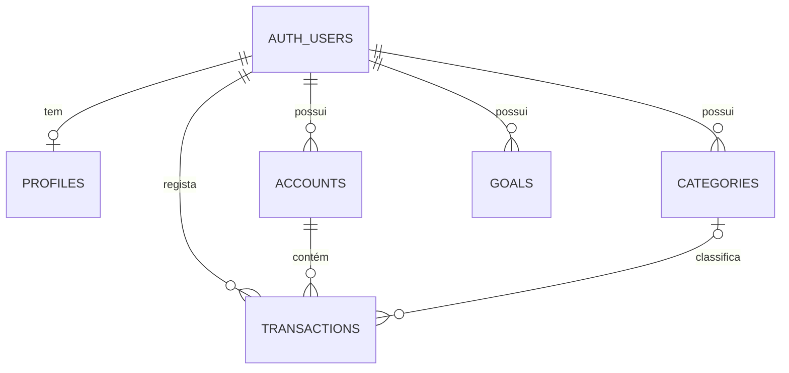

# Desenho de Dados — Despact

## Princípios

- PostgreSQL no Supabase é a fonte de verdade para dados persistentes.
- O `id` de cada entidade é UUID.
- Todos os registos criados pela aplicação usam `created_at` e `updated_at` em `timestamptz`.
- Dinheiro é guardado em unidades mínimas inteiras, de acordo com D-001 em `DECISIONS.md`.
- O saldo actual nunca é persistido como cópia numa conta; é calculado a partir do saldo inicial e das transacções.
- Todos os dados de domínio pertencem a um utilizador em `auth.users`.

## Modelo relacional

## Entidades

### `profiles`

Extensão opcional de `auth.users`, com uma linha por utilizador. Só deve conter dados próprios do produto, nunca palavras-passe ou dados de sessão.

| Campo | Tipo lógico | Regra |
| --- | --- | --- |
| `id` | UUID | Chave primária e referência para `auth.users.id`. |
| `display_name` | texto opcional | Nome apresentado na aplicação. |
| `preferred_currency_code` | texto | `EUR` por defeito; código ISO 4217. |

Um mecanismo seguro de criação de perfil será definido na migração de autenticação do Sprint 1. A aplicação não deve conseguir criar perfis para outro utilizador.

### `accounts`

| Campo | Tipo lógico | Regra |
| --- | --- | --- |
| `id` | UUID | Chave primária. |
| `user_id` | UUID | Obrigatório; referência para `auth.users.id`. |
| `name` | texto | Obrigatório e não vazio; único por utilizador entre contas activas. |
| `type` | enum | `cash`, `current`, `savings`, `credit_card` ou `loan`. |
| `currency_code` | texto | Obrigatório; código ISO 4217. |
| `opening_balance_minor` | inteiro 64-bit | Obrigatório; valor assinado em unidades mínimas. |
| `archived_at` | timestamp opcional | Uma conta arquivada mantém o histórico. |

O saldo apresentado é `opening_balance_minor + SUM(transactions.amount_minor)`. Uma conta arquivada não aceita novas transacções, mas continua a contribuir para o histórico e património até decisão futura em contrário.

### `categories`

| Campo | Tipo lógico | Regra |
| --- | --- | --- |
| `id` | UUID | Chave primária. |
| `user_id` | UUID | Obrigatório; referência para `auth.users.id`. |
| `name` | texto | Obrigatório e não vazio; único por utilizador e tipo, sem distinguir maiúsculas de minúsculas. |
| `type` | enum | `income` ou `expense`. |
| `archived_at` | timestamp opcional | Preserva classificações já existentes. |

Categorias são opcionais nas transacções no MVP, para que a velocidade de registo não fique bloqueada. Quando indicada, a categoria tem de pertencer ao mesmo utilizador e ter tipo compatível com a transacção.

### `transactions`

Cada linha representa um movimento que afecta uma única conta.

| Campo | Tipo lógico | Regra |
| --- | --- | --- |
| `id` | UUID | Chave primária. |
| `user_id` | UUID | Obrigatório; proprietário do movimento. |
| `account_id` | UUID | Obrigatório; conta do mesmo utilizador. |
| `kind` | enum | `income`, `expense` ou `transfer`. |
| `amount_minor` | inteiro 64-bit | Obrigatório e diferente de zero; valor assinado. |
| `currency_code` | texto | Obrigatório; igual à moeda da conta no MVP. |
| `occurred_on` | data | Obrigatório; dia financeiro do movimento, sem hora. |
| `description` | texto opcional | Nota curta introduzida pelo utilizador. |
| `category_id` | UUID opcional | Categoria do mesmo utilizador, compatível com `kind`. |
| `transfer_id` | UUID opcional | Identificador comum aos dois lados de uma transferência. |

Regras de integridade:

- `income` tem montante positivo e `expense` tem montante negativo;
- `transfer` não tem categoria e usa `transfer_id`;
- uma transferência é criada, editada ou eliminada como uma operação atómica de dois movimentos: negativo na origem e positivo no destino, com o mesmo valor absoluto, moeda e `transfer_id`;
- uma receita ou despesa não usa `transfer_id`;
- transacções não podem ser criadas em contas arquivadas.

O conjunto de regras que exige comparar linhas — em particular os dois lados de uma transferência — será concretizado por uma função PostgreSQL transaccional no Sprint 2, em vez de ser deixado apenas à interface.

### `goals`

| Campo | Tipo lógico | Regra |
| --- | --- | --- |
| `id` | UUID | Chave primária. |
| `user_id` | UUID | Obrigatório; referência para `auth.users.id`. |
| `name` | texto | Obrigatório e não vazio. |
| `target_amount_minor` | inteiro 64-bit | Obrigatório e maior que zero. |
| `current_amount_minor` | inteiro 64-bit | Obrigatório, maior ou igual a zero; progresso manual. |
| `currency_code` | texto | Obrigatório; EUR na experiência inicial. |
| `target_date` | data opcional | Data pretendida, sem hora. |
| `status` | enum | `active`, `completed` ou `archived`. |

O estado `completed` pode ser sugerido quando o progresso atinge o alvo, mas deve ficar explícito no modelo. O objectivo não reserva nem move dinheiro entre contas.

### Insights

Não existe tabela `insights` no MVP. Um insight é uma projecção calculada no momento a partir de transacções, contas e objectivos. Se no futuro houver notificações, histórico ou feedback sobre insights, esta decisão será revista através de uma migração e ADR.

## Isolamento e integridade

Cada tabela que contém dados de domínio tem `user_id`, uma chave estrangeira para `auth.users`, RLS activada e políticas de `SELECT`, `INSERT`, `UPDATE` e `DELETE` limitadas ao utilizador autenticado.

Além das políticas RLS, as relações entre `transactions` e `accounts`/`categories` têm de garantir o mesmo `user_id`. A migração usará chaves compostas ou uma validação PostgreSQL equivalente; não basta validar no cliente.

`CHECK` constraints asseguram valores não vazios, montantes válidos e combinações básicas de `kind`, sinal, categoria e transferência. Regras multi-linha e operações atómicas usam funções PostgreSQL com privilégios mínimos.

## Índices iniciais

Os índices devem suportar as consultas do MVP, sem antecipar analítica complexa:

- `accounts (user_id)` para listas de contas;
- `categories (user_id, type)` para selecção numa transacção;
- `transactions (user_id, occurred_on DESC)` para histórico e intervalos de painel;
- `transactions (account_id, occurred_on DESC)` para extracto e saldo de uma conta;
- `transactions (transfer_id)` parcial, apenas quando não nulo;
- `goals (user_id, status)` para objectivos activos.

Índices adicionais só são introduzidos com uma consulta real e respectivo plano de execução.

## Fora do esquema inicial

Não há, no MVP, tabelas para importações, instituições bancárias, anexos, orçamentos, notificações, famílias, permissões partilhadas, investimentos, taxas de câmbio ou histórico de auditoria. Estas estruturas serão acrescentadas apenas quando entrarem no roadmap.
